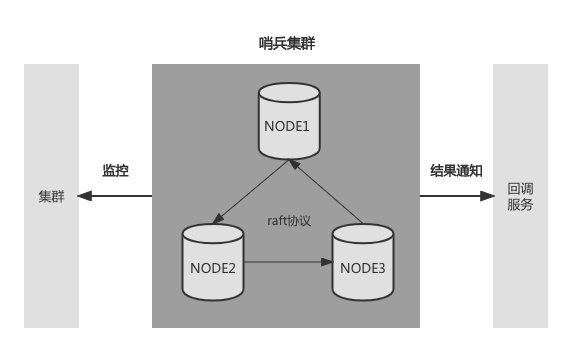

# health-check

#### 介绍
**health-check**
1. 基于raft协议的健康探活工具
2. 多点决策、避免单点视角
3. 支持http和tcp方式探活
4. 方便部署，运维方便
5. 对外提供http接口

#### 软件架构
软件架构

#### 安装教程

+ make编译
+ 最少三台机器部署

#### 使用说明

1.  xxxx
2.  xxxx
3.  xxxx

#### Test
+ go run main.go -config etc/health-check.ini
+ go run main.go -config etc/health-check2.ini
+ go run main.go -config etc/health-check3.ini

#### 特技

1.  使用 Readme\_XXX.md 来支持不同的语言，例如 Readme\_en.md, Readme\_zh.md